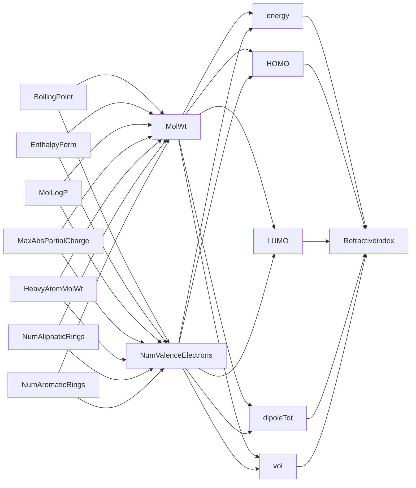

```mermaid
graph LR
    BoilingPoint -->MolWt
    BoilingPoint -->NumValenceElectrons
    EnthalpyForm -->MolWt
    EnthalpyForm -->NumValenceElectrons
    MolLogP -->MolWt
    MolLogP -->NumValenceElectrons
    MaxAbsPartialCharge -->MolWt
    MaxAbsPartialCharge -->NumValenceElectrons
    HeavyAtomMolWt -->MolWt
    HeavyAtomMolWt -->NumValenceElectrons
    NumAliphaticRings -->MolWt
    NumAliphaticRings -->NumValenceElectrons
    NumAromaticRings -->MolWt
    NumAromaticRings -->NumValenceElectrons
    MolWt -->energy
    MolWt -->HOMO
    MolWt -->LUMO
    MolWt -->dipoleTot
    MolWt -->vol
    NumValenceElectrons -->energy
    NumValenceElectrons -->HOMO
    NumValenceElectrons -->LUMO
    NumValenceElectrons -->dipoleTot
    NumValenceElectrons -->vol
    energy -->Refractiveindex
    HOMO -->Refractiveindex
    LUMO -->Refractiveindex
    dipoleTot -->Refractiveindex
    vol -->Refractiveindex
```
